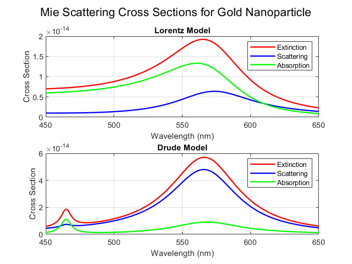

Mie Scattering of Gold Nanoparticles using Drude-Lorentz Model

Overview

This MATLAB script calculates the Mie scattering properties of spherical gold nanoparticles based on their optical properties derived from the Drude-Lorentz model. The code computes the complex permittivity of gold and then uses Mie theory to evaluate the extinction, scattering, and absorption efficiencies as a function of wavelength.

Methodology

1. Drude-Lorentz Model for Gold Permittivity

The complex permittivity (ε) of gold is computed using:

Drude Model: Accounts for free-electron contributions with plasma frequency (ω_p) and damping factor (γ).

Lorentz Model: Adds bound electron effects using oscillator parameters (A_p, B_p, C_p) for improved accuracy in the visible spectrum.

The permittivity is given by:

2. Mie Theory for Scattering Calculation

Using the computed complex refractive index (), the script applies Mie theory to evaluate:

Extinction efficiency (Q_ext)

Scattering efficiency (Q_sca)

Absorption efficiency (Q_abs) (obtained as Q_ext - Q_sca)

The Mie coefficients are computed using spherical Bessel functions.

Inputs

Wavelength range: 450-650 nm

Refractive index of medium (n_m)

Particle radius (r0)

Outputs

Extinction, scattering, and absorption efficiencies as a function of wavelength

Plots of Q_ext, Q_sca, and Q_abs vs. wavelength

How to Use

Ensure MATLAB is installed with required numerical functions.

Run the script.

The results are displayed in graphical format.

Applications

Nanophotonics: Understanding optical responses of gold nanoparticles.

Biosensing: Gold nanoparticles are widely used in plasmonic biosensors.

Optical Coatings: Useful for designing coatings with specific light absorption/scattering properties.

References

Mie, G. (1908). "Beiträge zur Optik trüber Medien, speziell kolloidaler Metallösungen." Annalen der Physik.

Johnson, P. B., & Christy, R. W. (1972). "Optical Constants of Noble Metals." Physical Review B.

